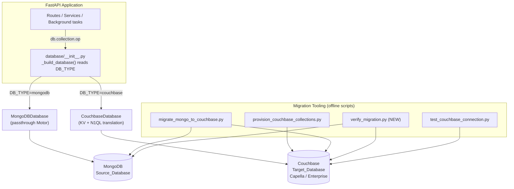
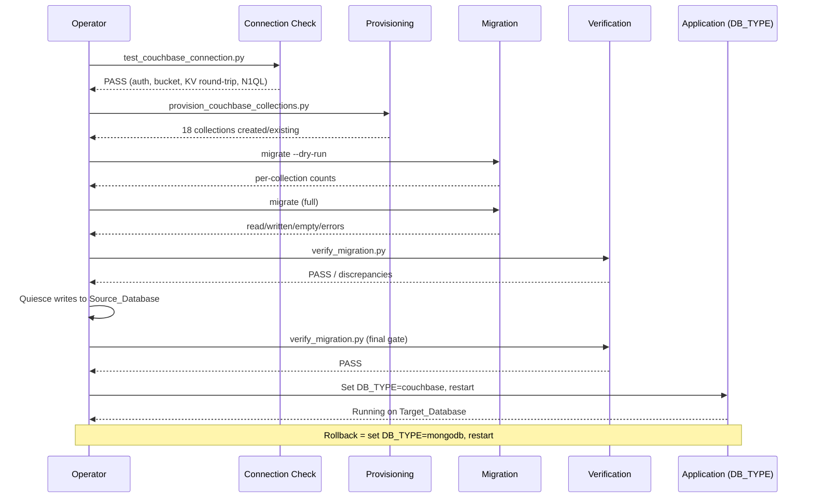

# Design Document

## Overview

This design covers the work required to **complete, harden, verify, and safely cut over** the
already-partially-built MongoDB-to-Couchbase migration for the `pjli-parking-app-CCE` FastAPI
application. It does not redesign the migration from scratch — the Motor-shaped abstraction layer,
the MongoDB and Couchbase adapters, adapter selection via `DB_TYPE`, the provisioning script, the
data-migration script, and startup wiring all already exist. The design documents how those pieces
fit together, closes the remaining behavioral and operational gaps, and defines the tooling and
procedures needed to migrate 18 collections with confidence.

The design is grounded in the actual code:

- `backend/database/interface.py` — abstract `DatabaseInterface`, `CollectionInterface`, `CursorInterface` (Motor-shaped).
- `backend/database/mongodb.py` — passthrough Motor wrapper (`MongoDBDatabase`) plus `create_indexes()`.
- `backend/database/couchbase_db.py` — `CouchbaseDatabase`, `CouchbaseCollection`, `CouchbaseCursor`, `_N1qlBuilder`, `_apply_update`, `_apply_projection`.
- `backend/database/__init__.py` — `_build_database()` adapter selector reading `DB_TYPE`.
- `backend/scripts/provision_couchbase_collections.py` — creates the 18 collections under `_default`.
- `backend/scripts/migrate_mongo_to_couchbase.py` — copies documents Mongo → Couchbase.
- `backend/scripts/test_couchbase_connection.py` — connection readiness check.
- `backend/config.py`, `backend/server.py` — configuration and startup wiring.

### Focus Areas and Findings

The codebase inspection surfaced several concrete facts that shape this design:

1. **The Couchbase query builder is already close to Mongo parity but has gaps to lock down.**
   `_N1qlBuilder._condition` implements `$in`, `$nin`, `$ne`, `$gt/$gte/$lt/$lte`, `$exists`, and
   `$regex` (with `$options` folded into RE2 inline flags), plus scalar-against-array matching
   (`` `field` = $p OR $p IN `field` ``). `$ne` is expanded to `IS MISSING OR IS NULL OR != value`
   to match Mongo semantics. Unknown operators raise `ValueError`. The design pins these behaviors
   as correctness properties so they cannot silently regress.

2. **The `aggregate()` method is a placeholder that returns `[]`.** A codebase-wide search
   (`\.aggregate\(`) confirms **no route, service, or background task calls `aggregate()`**. The gap
   is safe today but dangerous latent behavior: returning `[]` silently would hide a future
   aggregation bug. The design changes the placeholder to **raise** `NotImplementedError`.

3. **The migration script's docstring is inaccurate (Requirement 15).** The module docstring still
   describes the old key strategy — `"{collection}::{doc.id}"` keys and a `+ {"type": ...}` field —
   but the actual `upsert_batch()` writes **bare `id` keys with no `type` field**, matching what the
   adapter reads. This documentation drift must be corrected.

4. **A Verification_Tool does not yet exist.** Requirement 8 requires count comparison and
   field-value comparison between source and target. This is net-new tooling.

5. **`test_couchbase_connection.py` hardcodes credentials** (connection string, bucket, username,
   password) in source, violating Requirement 13.3, and uses `default_collection()` / a
   bucket-level primary index rather than the scoped `_default` collections the adapter uses. This
   must be reworked to read from environment variables and exercise the real keyspace.

6. **Index parity is defined but must be verified.** `MongoDBDatabase.create_indexes()` and
   `CouchbaseDatabase.create_indexes()` both exist; the design maps them field-by-field and treats
   any divergence as a defect.

7. **No operational runbook exists.** Requirements 10, 11, and 14 require a written, ordered
   procedure for provisioning, migrating, verifying, cutting over, and rolling back — including
   write-quiescing and a final verification gate.

### Design Principles

- **Behavioral parity over cleverness.** The Couchbase_Adapter must return the same result sets and
  produce the same document states as MongoDB for every operation the application actually uses.
- **Fail loud, never silent.** Unsupported operators and unimplemented capabilities raise errors;
  they never return empty or partial results.
- **Idempotent tooling.** Provisioning, index creation, and migration are safe to re-run.
- **Single-switch cutover.** `DB_TYPE` is the only runtime control that changes the active database.
- **Verify before trust.** No cutover is finalized without a passing verification run against
  quiesced writes.

## Architecture

The application talks to a single shared `db` object that conforms to `DatabaseInterface`. At import
time, `_build_database()` reads `DB_TYPE` and constructs either `MongoDBDatabase` (passthrough Motor)
or `CouchbaseDatabase` (KV + N1QL translation). All routes, services, and background tasks are
adapter-agnostic because they only use the Motor-shaped surface.



### Cutover Flow



### Storage Model

- **One native Couchbase collection per logical collection**, all under scope `_default` of the
  configured bucket. This mirrors the 18 MongoDB collections one-to-one.
- **Document key = bare `id`.** Because keyspaces are collection-scoped, no prefix and no `type`
  discriminator field are needed. This is the strategy both the adapter and the migration script use.
- **N1QL targets `` `bucket`.`_default`.`collection` ``** directly; no `WHERE type = ...` predicate.
- **KV_Fast_Path**: when a filter is exactly `{"id": <scalar>}`, the adapter performs a direct KV
  `get`/`replace`/`remove` instead of a N1QL query, for latency and to guarantee read-your-write.

## Components and Interfaces

### Abstraction Layer (existing, unchanged surface)

`DatabaseInterface`, `CollectionInterface`, and `CursorInterface` in `interface.py` define the
Motor-shaped contract. Both adapters implement it. The surface the application uses:

- Collection: `find_one`, `find`, `insert_one`, `insert_many`, `update_one`, `update_many`,
  `delete_one`, `delete_many`, `count_documents`, `find_one_and_update`, `find_one_and_delete`,
  `create_index`, `aggregate`.
- Cursor: `sort`, `limit`, `skip`, `to_list`.
- Database: `connect`, `disconnect`, `get_collection`, attribute access (`db.users`), `is_connected`,
  `create_indexes`.

### MongoDB_Adapter (`mongodb.py`, existing)

Thin passthrough around Motor. `create_indexes()` defines the authoritative index set that the
Couchbase side must mirror. No behavior change in MongoDB mode.

### Couchbase_Adapter (`couchbase_db.py`, existing + hardening)

The central component. Key sub-parts:

- **`_N1qlBuilder`** — translates Mongo-style filters to parameterized N1QL `WHERE` fragments.
  - Handles operator dicts (`$in`, `$nin`, `$ne`, `$gt/$gte/$lt/$lte`, `$exists`, `$regex`+`$options`).
  - Folds `$options` (`i`, `s`, `m`) into an RE2 inline-flag prefix `(?ism)` on the pattern.
  - Uses `REGEXP_CONTAINS` for `$regex` to match Mongo's substring (unanchored) semantics.
  - Expands `$ne` to `IS MISSING OR IS NULL OR != value` for Mongo parity.
  - For scalar equality, emits `` (`field` = $p OR $p IN `field`) `` so a scalar matches when the
    document field is an array containing that scalar (PPA-70 fix).
  - Raises `ValueError` naming any unsupported operator.
  - **Hardening:** the current `$ne`/`$exists` handling mutates the shared `value`/`params` dict
    (`value.pop("$options")`, `self._params.pop(p)`); the design keeps this behavior but pins it with
    tests so the mutation cannot cause cross-condition leakage.
- **`_apply_update`** — applies `$set`, `$inc` (missing treated as 0), `$addToSet` (with `$each`,
  de-duplicated), `$unset`; a plain document (no `$` keys) is treated as a full replacement merge.
  Raises `ValueError` naming any unsupported update operator.
- **`_apply_projection`** — include/exclude semantics; always strips `_id`.
- **`CouchbaseCursor`** — lazily builds `SELECT ... FROM keyspace WHERE ... [ORDER BY] [LIMIT] [OFFSET]`
  on `to_list()`; `sort`/`limit`/`skip` are chainable.
- **`CouchbaseCollection`** — implements all collection methods with a KV fast-path for `{"id": X}`
  and an N1QL general path. `find_one_and_update` honors `return_document` (before by default, after
  when set) and `upsert`.
- **`CouchbaseDatabase`** — connection lifecycle, deployment tuning, TLS options, and
  `create_indexes()` (primary + secondary GSI, all `IF NOT EXISTS`, run in parallel).

**Change 1 — `aggregate()` must raise.** The placeholder returning `[]` becomes:

```python
async def aggregate(self, pipeline):
    raise NotImplementedError(
        "aggregate() is not implemented in the Couchbase adapter. "
        "No application code path uses aggregation; if one is added, "
        "implement the required pipeline stages here."
    )
```

This satisfies Requirement 4.2 (fail loud) while Requirement 4.1 is satisfied by the documented,
repeatable codebase search that confirms no caller exists.

### Adapter_Selector (`__init__.py`, existing)

`_build_database()` reads `DB_TYPE` (default `mongodb`), builds the matching adapter, and raises
`ValueError` for any other value. Couchbase construction passes `deployment`, `trust_store_path`,
`cert_path`, and `tls_verify` from the environment.

### Provisioning_Script (`provision_couchbase_collections.py`, existing)

Creates all 18 collections under `_default`. Idempotent: `CollectionAlreadyExistsException` (and the
string `"already exist"`) is treated as "exists". Reports created/existing/errors and exits non-zero
on any real error.

### Migration_Script (`migrate_mongo_to_couchbase.py`, existing + doc fix)

Copies documents per collection with `upsert_multi` batching. Supports positional collection names,
`--dry-run`, and `--wipe`. Uses bare `id` keys and generates an `id` when missing. Reports
read/written/empty/errors and exits non-zero on errors.

**Change 2 — docstring correction (Requirement 15).** Replace the module docstring's key-strategy
description so it states: key = bare document `id`; no key prefix; no added `type` field; body =
document with a guaranteed `id`.

### Verification_Tool (`verify_migration.py`, NEW)

New offline script that:

1. Reads counts per collection from both databases and reports any per-collection count discrepancy
   (source count, target count).
2. Streams each source document, fetches the target document by `id`, and compares field values
   excluding `_id`.
3. Reports an overall **PASS** only if it runs to completion **and** every compared target document
   matches its source; otherwise reports **FAIL** with the list of discrepancies.
4. Exits non-zero on FAIL or on any error, and never prints PASS if it aborts early.

Interface:

```
python scripts/verify_migration.py                 # all 18 collections
python scripts/verify_migration.py users buildings  # named collections
python scripts/verify_migration.py --counts-only     # count comparison only
```

### Connection_Readiness_Check (`test_couchbase_connection.py`, existing + rework)

**Change 3 — remove hardcoded credentials and exercise the real keyspace.** The reworked script:

1. Reads `COUCHBASE_CONNECTION_STRING`, `COUCHBASE_BUCKET`, `COUCHBASE_USERNAME`,
   `COUCHBASE_PASSWORD`, and TLS/deployment settings from the environment (Requirement 13.3).
2. Authenticates, opens the bucket, performs a KV **write → read → remove** round trip against a
   scoped `_default` collection, and runs a N1QL `COUNT(*)` query (Requirement 13.1).
3. On any step failure, prints the failing step and exits non-zero (Requirement 13.2).

## Data Models

### Logical Collections (18)

`users`, `sessions`, `buildings`, `floors`, `parking_slots`, `vehicles`, `zones`, `parking_configs`,
`building_policies`, `slot_registrations`, `reservations`, `waitlist_entries`, `event_blocks`,
`notifications`, `site_content`, `templates`, `ai_insights`, `migrations`.

### Document Shape and Key Strategy

| Aspect | MongoDB (Source) | Couchbase (Target) |
| --- | --- | --- |
| Primary identifier | application `id` field (plus Mongo `_id`) | application `id` field |
| Storage key | Mongo `_id` (opaque) | bare `id` string |
| `_id` field | present | never stored; stripped on read/projection |
| `type` discriminator | none | none (collection-scoped keyspace) |
| Missing `id` on insert | app supplies UUID | adapter/migration generate `str(uuid4())` |

A migrated document is byte-for-field identical to the source document minus `_id`, so the
application reads it back without transformation (Requirement 15.3).

### Operator Support Matrix

| Category | Supported | Semantics |
| --- | --- | --- |
| Query | `$in` | field value in list; missing = non-match |
| Query | `$nin` | field value not in list; missing = match |
| Query | `$ne` | missing, null, or `!= value` |
| Query | `$gt`,`$gte`,`$lt`,`$lte` | comparison; missing = non-match |
| Query | `$exists` | present (true) / absent (false) |
| Query | `$regex` + `$options` | `REGEXP_CONTAINS`; honors `i`,`s`,`m`; missing = non-match |
| Query | scalar vs array field | matches when array contains scalar |
| Update | `$set` | assign fields |
| Update | `$inc` | add to field; missing = 0 |
| Update | `$addToSet` (+`$each`) | append if not present |
| Update | `$unset` | remove fields |
| Any other | — | raises `ValueError` naming the operator |

### Index Parity Map

Primary index on all 18 collections plus secondary GSI mirroring `MongoDBDatabase.create_indexes()`:

| Collection | Indexed fields (secondary) |
| --- | --- |
| users | `email`, `role` |
| sessions | `user_id` |
| reservations | `user_id`, `building_id`, (`slot_id`,`date`), `qr_token` |
| floors | `building_id` |
| parking_slots | `floor_id` |
| vehicles | `user_id` |
| notifications | (`user_id`,`created_at`) |
| parking_configs | `building_id` |
| building_policies | `building_id` |
| site_content | `key` |
| slot_registrations | (`slot_id`,`status`), (`user_id`,`status`), (`building_id`,`status`) |
| waitlist_entries | (`building_id`,`preferred_date`,`status`), (`user_id`,`status`) |
| event_blocks | (`building_id`,`date`) |

All Couchbase index statements use `IF NOT EXISTS`, so re-running leaves existing indexes unchanged.
Note: Couchbase does not enforce the `unique=True` constraints MongoDB declares (e.g. `users.email`);
uniqueness continues to be enforced by application logic, and this is called out in the runbook.

### Configuration Model

| Variable | Purpose | Modes |
| --- | --- | --- |
| `DB_TYPE` | active adapter (`mongodb` \| `couchbase`) | both |
| `MONGO_URL`, `DB_NAME` | source connection | mongodb |
| `COUCHBASE_CONNECTION_STRING` | `couchbases://` (TLS) or `couchbase://` | couchbase |
| `COUCHBASE_BUCKET` | target bucket | couchbase |
| `COUCHBASE_USERNAME`, `COUCHBASE_PASSWORD` | cluster credentials | couchbase |
| `COUCHBASE_DEPLOYMENT` | `capella` (applies `wan_development`) \| `enterprise` | couchbase |
| `COUCHBASE_TRUST_STORE_PATH` | CA cert PEM for TLS validation | couchbase (enterprise) |
| `COUCHBASE_CERT_PATH` | client cert for mutual TLS | couchbase (optional) |
| `COUCHBASE_TLS_VERIFY` | `peer` (default) \| `none` (dev only) | couchbase |

## Correctness Properties

*A property is a characteristic or behavior that should hold true across all valid executions of a
system — essentially, a formal statement about what the system should do. Properties serve as the
bridge between human-readable specifications and machine-verifiable correctness guarantees.*

These properties suit property-based testing because the core of the migration is **pure
translation logic**: `_N1qlBuilder` (filter → predicate), `_apply_update` (update operators → new
document), `_apply_projection` (projection → shaped document), the migration key-derivation, and the
verification comparison. Each has universal behavior over a large input space. Infrastructure
concerns (provisioning, index DDL, startup wiring, TLS configuration, the runbook) are validated by
integration, smoke, example, and review tests instead — they are not property-based tested.

The query-operator properties below are all validated against a single **reference model evaluator**:
a small, obviously-correct in-memory implementation of MongoDB filter semantics. The adapter's
translation is asserted to select exactly the same documents as the model for every generated input.

### Property 1: `$in` selection matches MongoDB semantics

*For any* set of documents and any `$in` value list, the adapter selects exactly the documents whose
field value is contained in the list, and never selects a document where the field is missing.

**Validates: Requirements 1.1**

### Property 2: `$nin` selection matches MongoDB semantics

*For any* set of documents and any `$nin` value list, the adapter selects exactly the documents whose
field value is not in the list, and always selects a document where the field is missing.

**Validates: Requirements 1.2**

### Property 3: `$ne` matches missing, null, or unequal values

*For any* set of documents and any comparison value, the adapter selects exactly the documents where
the field is missing, is null, or holds a value not equal to the comparison value.

**Validates: Requirements 1.3**

### Property 4: Range comparisons match MongoDB semantics

*For any* set of documents, any comparator in {`$gt`, `$gte`, `$lt`, `$lte`}, and any threshold, the
adapter selects exactly the documents whose field satisfies the comparison, and never selects a
document where the field is missing.

**Validates: Requirements 1.4**

### Property 5: `$exists` matches presence and absence

*For any* set of documents and any boolean, `$exists: true` selects exactly the documents where the
field is present and `$exists: false` selects exactly the documents where the field is absent.

**Validates: Requirements 1.5**

### Property 6: `$regex` performs flagged substring matching

*For any* set of string-valued documents, any regex pattern, and any subset of the flags `i`, `s`,
`m`, the adapter selects exactly the documents whose field contains a substring matching the pattern
under those flags, and never selects a document where the field is missing.

**Validates: Requirements 1.6**

### Property 7: Scalar filters match array-valued fields by containment

*For any* set of documents and any scalar filter value, when a document's field holds an array the
adapter selects it if and only if the array contains the scalar, and when the field holds a scalar it
selects it if and only if the scalar is equal.

**Validates: Requirements 1.7**

### Property 8: Unsupported query operators raise a naming error

*For any* operator token that is not in the supported query-operator set, translating a filter
containing it raises an error whose message contains the offending operator token.

**Validates: Requirements 1.8**

### Property 9: Update operators produce MongoDB-equivalent document state

*For any* document and any update composed of the supported operators (`$set`, `$inc` treating a
missing field as zero, `$addToSet` with or without `$each` appending only values not already
present, `$unset`), applying the update produces the same document state MongoDB would produce, and
fields not named by the update are unchanged.

**Validates: Requirements 2.1, 2.2, 2.3, 2.4, 2.5**

### Property 10: Unsupported update operators raise a naming error

*For any* operator token that is not in the supported update-operator set, applying an update
containing it raises an error whose message contains the offending operator token.

**Validates: Requirements 2.6**

### Property 11: Projection includes/excludes correctly and always strips `_id`

*For any* document and any MongoDB-style projection, the projected result contains exactly the fields
the projection selects (inclusion or exclusion semantics) and never contains an `_id` field
regardless of the projection.

**Validates: Requirements 3.3**

### Property 12: Sort, skip, and limit compose like MongoDB

*For any* dataset, any sort specification, any non-negative skip, and any limit, the cursor returns
the dataset ordered by the sort keys, then offset by skip, then truncated to limit — identical to the
reference model of sort-then-skip-then-limit.

**Validates: Requirements 3.2**

### Property 13: `find_one_and_update` returns the correct snapshot

*For any* matching document and any update, `find_one_and_update` returns a snapshot equal to the
pre-update document by default, and a snapshot equal to the post-update document when the
after-document preference is set.

**Validates: Requirements 3.4**

### Property 14: Upsert derives the new document from filter and update

*For any* filter that yields no match and any update, an upsert creates a document whose fields are
the filter merged with the applied update operators and which carries an `id`.

**Validates: Requirements 3.6**

### Property 15: KV fast-path equals the N1QL general path

*For any* stored document, retrieving it with the filter `{"id": <scalar>}` via the KV fast-path
returns a result equivalent to retrieving the same document through the general N1QL path (same
document content and same projection handling).

**Validates: Requirements 3.8**

### Property 16: Migration key derivation uses the bare `id`

*For any* source document, the migration writes it under a target key equal to the document's `id`,
generates an `id` when the source lacks one, and the stored body carries that same `id`.

**Validates: Requirements 7.3, 15.1, 15.2**

### Property 17: Migration is idempotent

*For any* set of source documents, running the migration twice produces the same target state as
running it once (repeated upserts converge), so a repeated run never diverges from a single run.

**Validates: Requirements 7.5**

### Property 18: Migrate-then-read round-trip preserves the document

*For any* source document, migrating it and then reading it back through the Couchbase adapter yields
a document equal to the source with the `_id` field removed, requiring no transformation.

**Validates: Requirements 15.3**

### Property 19: Verification count comparison flags exactly the mismatched collections

*For any* pair of per-collection source and target count maps, the verification tool reports a
discrepancy for exactly those collections whose source and target counts differ, and each reported
discrepancy includes the collection name, the source count, and the target count.

**Validates: Requirements 8.1, 8.2**

### Property 20: Verification field comparison yields PASS only on full equality

*For any* set of source/target document pairs compared by `id`, the verification tool reports an
overall PASS if and only if every compared target document equals its source document after excluding
`_id`; otherwise it reports FAIL and lists every field-value discrepancy.

**Validates: Requirements 8.3, 8.4**

### Property 21: Adapter selection maps `DB_TYPE` deterministically

*For any* value of `DB_TYPE`, the adapter selector constructs the MongoDB adapter when the value is
`mongodb` or unset, constructs the Couchbase adapter when the value is `couchbase`, and otherwise
raises an error whose message contains the unsupported value (case- and whitespace-insensitive for
the two supported values).

**Validates: Requirements 9.1, 9.2, 9.3, 10.1**

## Error Handling

The migration follows a **fail-loud** discipline: operations either succeed with MongoDB-equivalent
results or raise a clear, actionable error. Silent empty/partial results are treated as defects.

### Adapter-level errors

| Condition | Behavior | Requirement |
| --- | --- | --- |
| Unsupported query operator | `_N1qlBuilder` raises `ValueError` naming the operator | 1.8 |
| Unsupported update operator | `_apply_update` raises `ValueError` naming the operator | 2.6 |
| `aggregate()` called | raises `NotImplementedError` (was silent `[]`) | 4.2 |
| `find_one_and_update` replace fails | error propagates; no document returned | 3.5 |
| Upsert document creation fails | error propagates | 3.7 |
| Upsert without derivable `id` | raises `ValueError` ("Upsert requires 'id' …") | 3.6 |
| Not connected | `get_collection` raises `RuntimeError` | — |

### Connection and TLS errors

- **Cluster not ready within timeout:** `wait_until_ready(30s)` bounds the wait; if the cluster does
  not become ready the subsequent operation surfaces the failure rather than hanging (Req 12.8).
- **Unusable trust store:** when `COUCHBASE_TRUST_STORE_PATH` is set but cannot be used for
  validation, the connection fails; the adapter never silently falls back to default validation
  (Req 12.5). Only fields the operator actually set are passed to `ClusterOptions`, so an unset path
  never reaches the SDK.
- **`tls_verify=none`:** verification is skipped intentionally (dev only) and is flagged in the
  runbook as unsafe for production (Req 12.7).

### Startup errors (server.py)

Startup is resilient by design: each step (index creation, one-time cleanup migration, admin seeding)
is wrapped so a failure is logged and the remaining steps still run (Req 9.5, 6.4). Connection itself
(`init_db`) is the one hard prerequisite.

### Tooling errors

- **Provisioning:** `CollectionAlreadyExistsException` and `"already exist"` strings are treated as
  success; any other failure is recorded per collection and the script exits non-zero (Req 5.3).
- **Migration:** per-collection read/write errors are recorded and reported; a document that cannot
  yield a key is skipped and migration continues; the script exits non-zero if any error occurred
  (Req 7.4, 7.8).
- **Verification:** any exception aborts with a non-zero exit and, critically, **never prints PASS**
  when the run does not complete (Req 8.5).
- **Connection check:** each of the four steps reports the specific failing step and exits non-zero
  (Req 13.2).

## Testing Strategy

The application already depends on `pytest`. Property-based testing will be added using
**Hypothesis** (the standard Python PBT library) — it will be added to `backend/requirements.txt`.
Property-based testing is NOT implemented from scratch.

### Dual approach

- **Property tests (Hypothesis):** the 21 correctness properties above, covering the pure
  translation logic, key derivation, idempotence, round-trip fidelity, verification comparison, and
  adapter selection.
- **Example / unit tests (pytest):** method return-shape conformance (Req 3.1), `find_one_and_update`
  and upsert failure propagation (Req 3.5, 3.7), `aggregate()` raising (Req 4.2), provisioning
  reporting and error handling (Req 5.3, 5.4), migration selection/dry-run/reporting (Req 7.2, 7.6,
  7.8), startup wiring and resilience (Req 9.4, 9.5, 6.4), TLS/deployment configuration mapping
  (Req 12.1–12.7), and connection-check failure reporting (Req 13.2).
- **Integration tests (1–3 examples, real or mocked cluster):** provisioning against a bucket
  (Req 5.1, 5.2), re-run index idempotence (Req 6.3), full and wipe migration (Req 7.1, 7.7),
  connection readiness end-to-end (Req 13.1), and cluster-timeout surfacing (Req 12.8).
- **Smoke / static guards (single execution):** a CI check asserting no `.aggregate(` caller exists
  (Req 4.1); assertions that `create_indexes` emits a primary index for all 18 collections and every
  required secondary index (Req 6.1, 6.2); a check that `test_couchbase_connection.py` reads
  credentials from the environment and contains no credential literals (Req 13.3); and docstring
  accuracy checks on the migration script (Req 15.1, 15.2).
- **Runbook review checklist (documentation):** Requirements 10.2, 10.3, 11.1, 11.2, 11.3, 14.1,
  14.2, 14.3, 14.4 are satisfied by the written Operational_Runbook and verified by review, not code.

### Property test configuration

- Each property test runs a **minimum of 100 iterations** (Hypothesis `max_examples>=100`).
- Each property test is tagged with a comment referencing its design property in the format:
  **Feature: mongodb-to-couchbase-migration, Property {number}: {property_text}**
- Each correctness property is implemented by a **single** property-based test.
- Query-operator properties (1–7) share a reference model evaluator; the adapter's selection is
  asserted equal to the model's selection for every generated input. Where running real N1QL is
  impractical in unit scope, the translated predicate is evaluated by an equivalent in-memory
  interpreter of the emitted `WHERE` fragment so the *translation* is what is under test; a small set
  of integration tests then confirms the interpreter matches live Couchbase behavior.

### Test organization

```
backend/tests/
  test_query_operators_property.py     # Properties 1-8
  test_update_operators_property.py    # Properties 9-10
  test_projection_property.py          # Property 11
  test_cursor_sort_skip_limit_property.py  # Property 12
  test_find_one_and_update_property.py # Properties 13-14
  test_kv_fastpath_equivalence_property.py # Property 15
  test_migration_property.py           # Properties 16-18
  test_verification_property.py        # Properties 19-20
  test_adapter_selector_property.py    # Property 21
  test_adapter_examples.py             # Example/unit tests
  test_provisioning.py                 # Provisioning unit/integration
  test_indexes.py                      # Index DDL smoke checks
  test_startup.py                      # Startup wiring tests
  test_connection_config.py            # TLS/deployment config tests
  integration/                         # Cluster-backed integration tests
```
