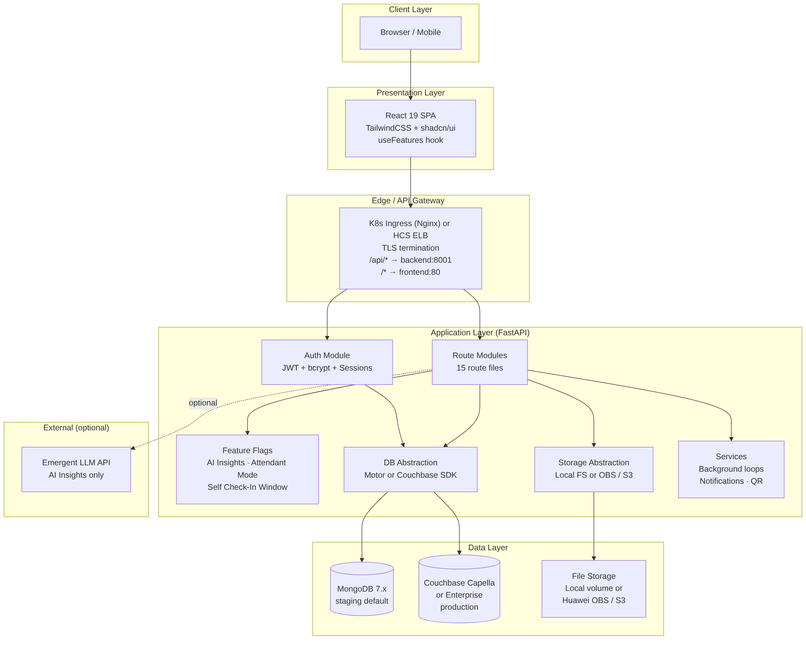
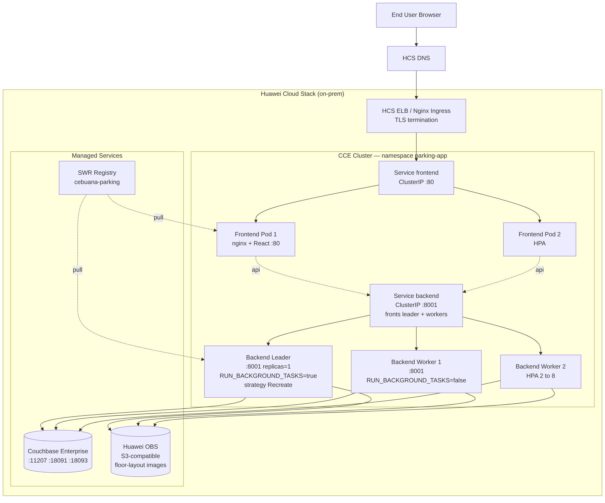
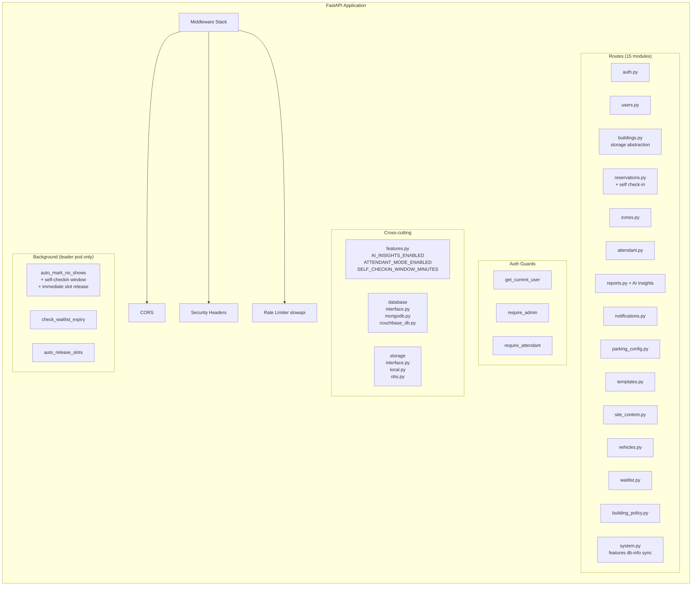
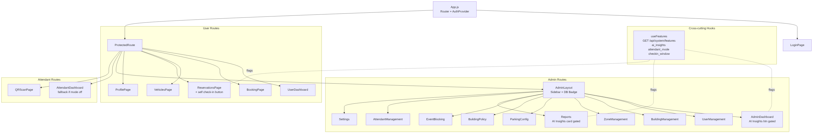

# Architecture Diagrams
**Related:** [System Design](../system-design.md) · Last Updated: May 12, 2026

> All diagrams use Mermaid syntax, compatible with GitHub Markdown rendering.

---

## 1. Component Architecture (UML Component Diagram)

---

## 2. Deployment Architecture — Huawei CCE (Kubernetes) Production Target

---

## 3. Application Layer Detail

---

## 4. Frontend Component Tree

---

*Back to: [System Design](../system-design.md) | Next: [ERD](erd.md)*
