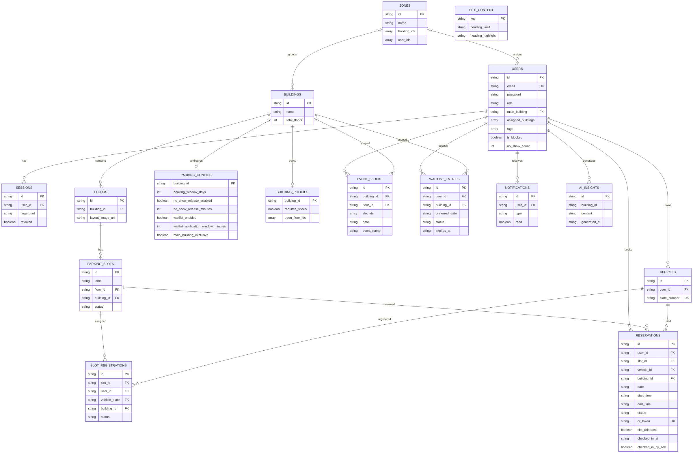

# Entity Relationship Diagram
**Related:** [System Design](../system-design.md) · Last Updated: May 12, 2026

> The ERD below is **database-agnostic**: the same entities exist in both MongoDB (collections) and Couchbase (collections inside the `_default` scope of bucket `db_parking`). The DB Abstraction Layer keeps the application code identical against either backend.

---

## ERD (Mermaid)

---

## Index Summary

The same logical indexes are present on both DB backends; the abstraction layer maps them to the appropriate primitive (MongoDB index spec / Couchbase GSI).

| Collection | Indexes |
|-----------|---------|
| users | `id` (unique), `email` (unique) |
| sessions | `id` (unique), `user_id` |
| reservations | `id` (unique), `user_id`, `building_id`, `slot_id`, `date`, `qr_token`, compound(`slot_id+date+status`), compound(`status+date+slot_released`) |
| buildings | `id` (unique) |
| floors | `id` (unique), `building_id` |
| parking_slots | `id` (unique), `floor_id` |
| vehicles | `id` (unique), `user_id`, `plate_number` (unique) |
| zones | `id` (unique) |
| notifications | `id` (unique), compound(`user_id+created_at`) |
| parking_configs | `building_id` (unique) |
| building_policies | `id` (unique), `building_id` (unique) |
| slot_registrations | `id` (unique), compound(`slot_id+user_id+status`), `vehicle_plate` |
| event_blocks | `id` (unique), compound(`building_id+date`), compound(`floor_id+date`) |
| waitlist_entries | `id` (unique), compound(`building_id+preferred_date+status`) |
| ai_insights | `id`, `generated_at` |
| site_content | `key` (unique) |

---

*Back to: [System Design](../system-design.md) | Next: [Sequence Diagrams](sequences.md)*
