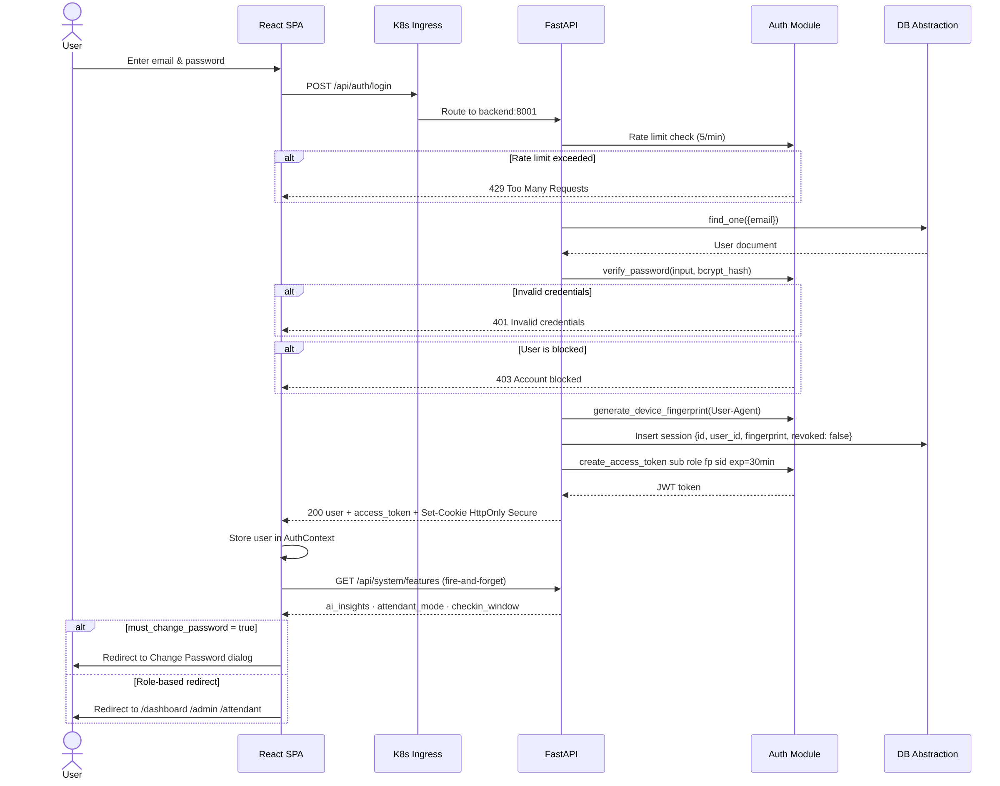
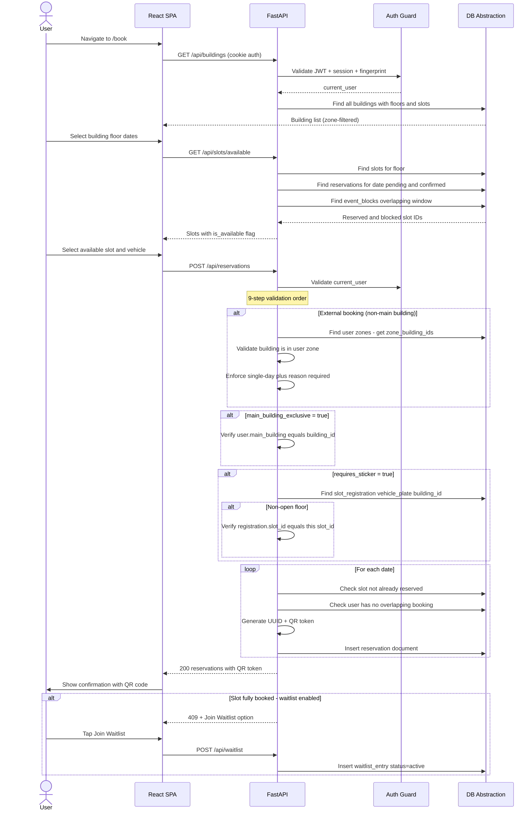
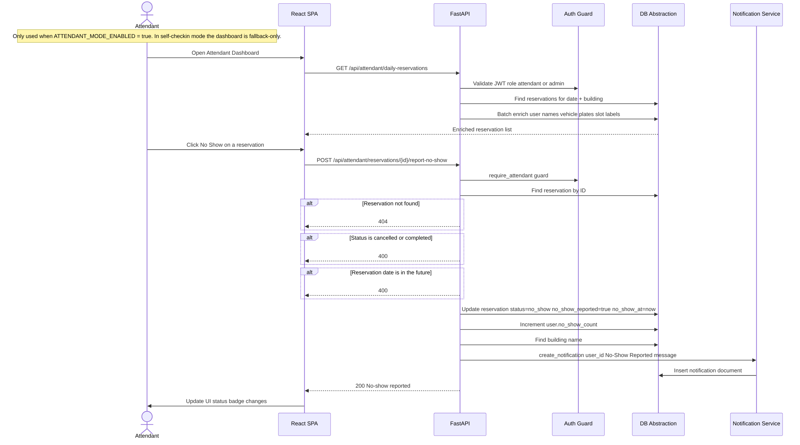
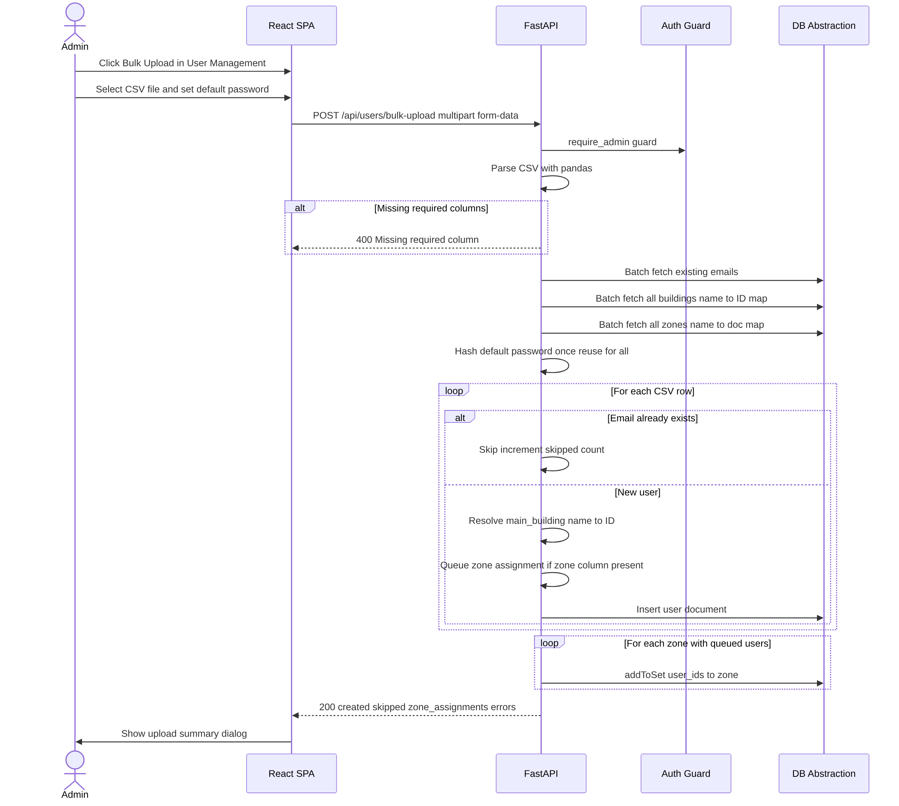
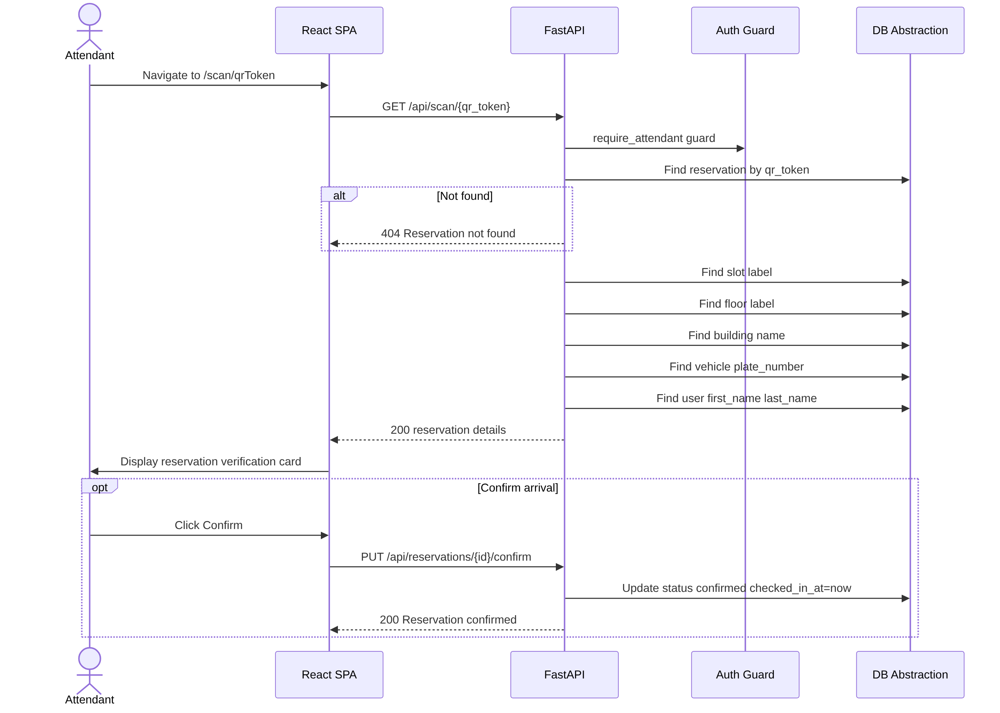
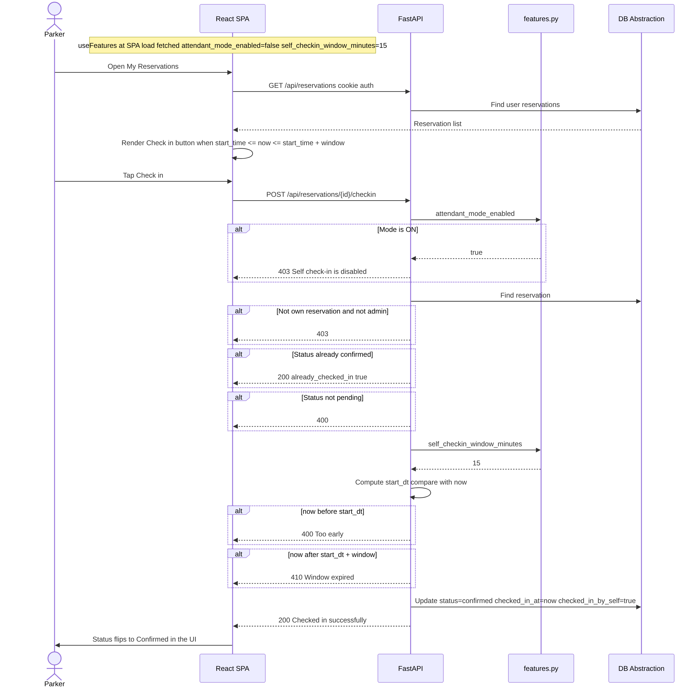
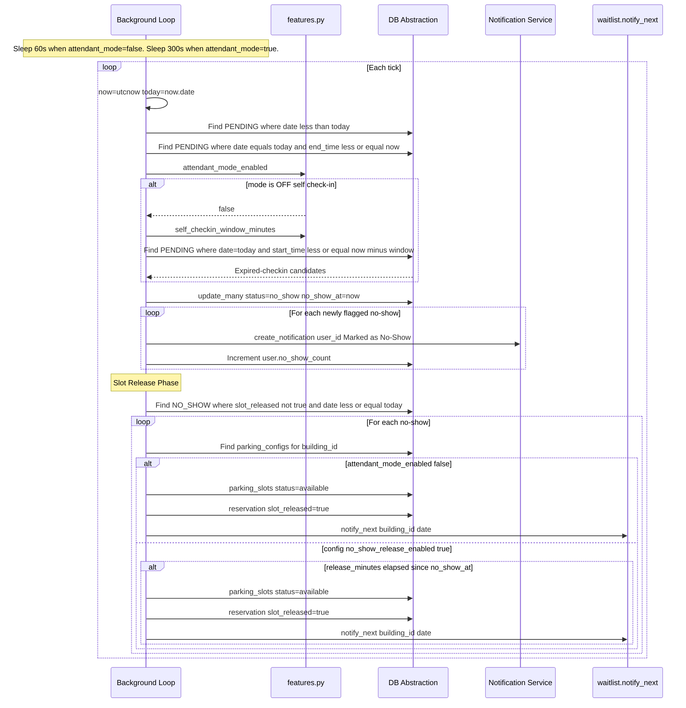
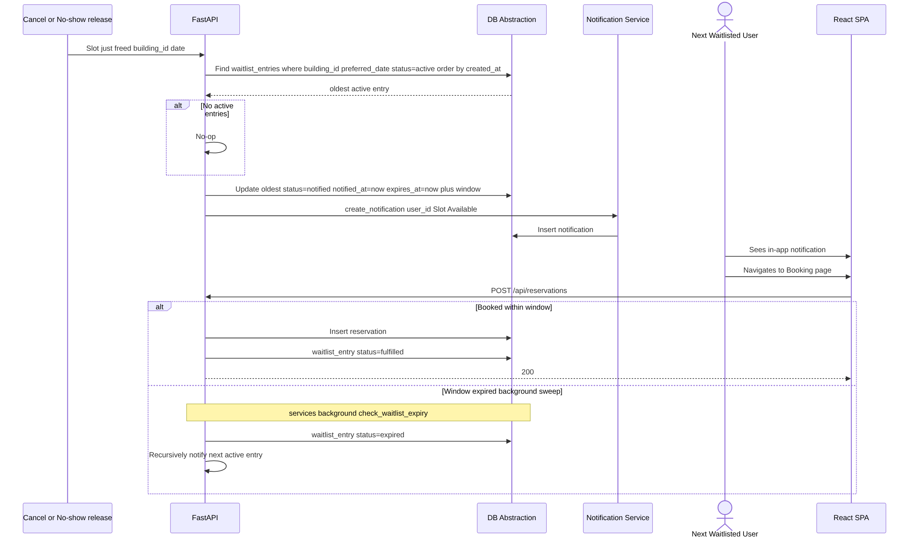
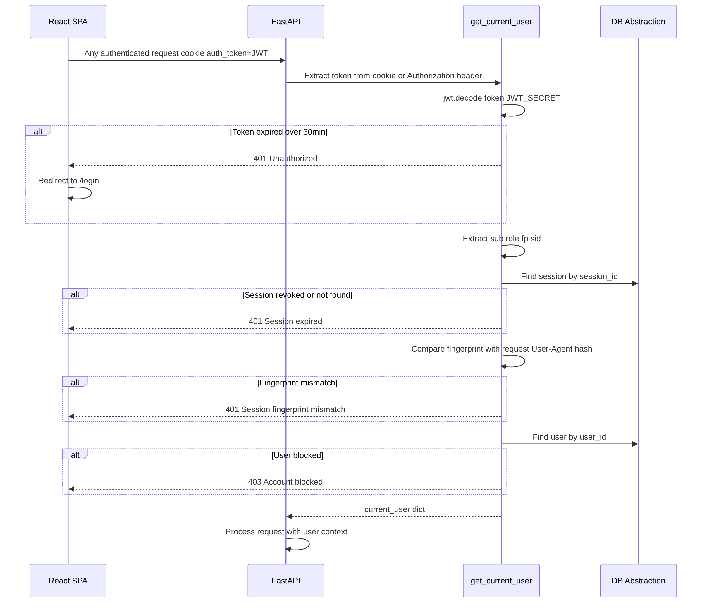

# Sequence Diagrams
**Related:** [System Design](../system-design.md) · Last Updated: May 12, 2026

> All diagrams use Mermaid syntax, compatible with GitHub Markdown rendering. The participant `DB` represents the **DB Abstraction Layer** which speaks to MongoDB or Couchbase depending on `DB_TYPE`.

---

## 1. User Login Sequence

---

## 2. Parking Reservation Booking Sequence

---

## 3. Attendant No-Show Reporting Sequence

---

## 4. Admin Bulk User Upload Sequence

---

## 5. QR Code Scan Verification Sequence

---

## 6. Self Check-In Sequence (Attendant Mode OFF)

---

## 7. Background No-Show + Waitlist Notification Sequence

---

## 8. Waitlist Notification & Claim Sequence

---

## 9. Session Validation Sequence (Every Authenticated Request)

---

*Back to: [System Design](../system-design.md) | Next: [Compliance Matrix](../compliance-matrix.md)*
